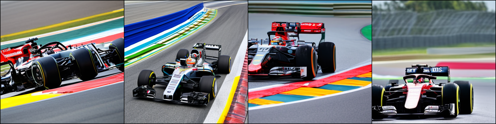

# DeepCache

[Original implementation](https://github.com/horseee/DeepCache/tree/master) uses Hugging Face's diffuser pipeline. This implementation applies DeepCache to the [Apple's Stable Diffusion repo](https://github.com/ml-explore/mlx-examples/tree/main/stable_diffusion) with MLX framework.

## Get Started
`python3 main.py`

## Performance
### Stable Diffusion v2.1
1. Original (~76s)
   
2. DeepCache (~30s)
   
3. HuggingFace Diffusers with MPS (~64s)
   
4. HF Diffusers with original DeepCache (~26s)
   
> These tests are conducted on M1 max device with 32 core GPU